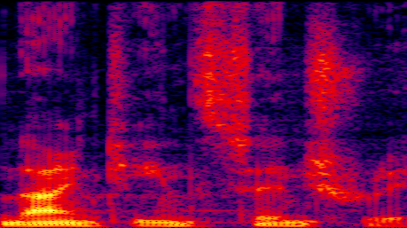

---



## Part 1: Searching for Scores ##  
 
A lot of work has been done in the past few years on the problem of playlist generation and music recommendation. Pandora and Spotify are probably the first services that come to mind -- they both use user inputs to find good matches in an extensively annotated database. 

Pandora's core reason for being is that is makes excellent recommendations, and Spotify is betting that good recommendations and a (much, much, much) larger library will give it the edge over streaming services from Apple and Google. The method of annotation differs (Pandora is mostly done manually and Spotify uses [Echonest](http://the.echonest.com) for automated annotation), but the search algorithm is fundamentally the same. 

Music recommendation isn't just important for streaming services, though. Most commercial tracks (for TV, movies, and ads) are not actually bespoke compositions. They are licensed from production music libraries like [Cutting Edge](http://cuttingedge.sourceaudio.com) or [Jingle Punks](http://jinglepunks.com). Just like in streaming services, the tracks are annotated and searchable. However:

* Search is extremely limited, often based on a short list of keywords
* Most music libraries only have a few thousand tracks each -- [APM](http://www.apmmusic.com), which links dozens of disparate libraries, has ~400K. Pandora has 1m tracks at a much finer grain of analysis, and Spotify has 20m(!).

But why compare streaming services to production music in the first place? Aren't they apples and oranges? These days, not really:

<figure class='align-right'>
	
	<figcaption>VW's <i>Milky Way</i></figcaption>
</figure>

* Many projects use 'syncs', which means that they use a pre-existing recording by a performing artist. Volkswagen kicked off the modern version of this practice in 1999 with its critically lauded, internet-released [*Milky Way*](https://www.youtube.com/watch?v=0nWuCZe4lSE), featuring the music of Nick Drake. The largest production libraries are actually subsidiaries of the largest record companies, who hold the rights to their back catalogs. 

* Emerging artists are turning to syncs as a very potent marketing tool. Nick Drake sold a ton of records after being featured in that VW commercial (although he wasn't around to enjoy it, unfortunately). Think about all the bands you heard for the first time on an [Apple commercial](http://www.applemusic.info).

The line between performing artists and production music has blurred so much in the past 10 years that the real search space for production music is actually much larger than it appears. We need *better* search and *more* search, because any track, especially a newer release, is a potential backing track. 

So, how do we label tracks for use as production music?

***

## Part 2: Automated Tagging ##
 
Although manual annotation, done well, still produces better recommendations than automated tagging (this highly scientific observation is based on a handful of casual conversations about Pandora's recommendations compared to Spotify), it's simply unfeasible for the project of *expanding* the search space for production music. So, the annotations must be automated.

But what sort of annotations you would ultimately want in the first place to match up music to images? Is a set of emotion and genre tags enough? Maybe, but that assumes that the user knows the particular recipe that will generate a good recommendation. In addition, music and image interact in such a way as to transform the emotional content of both media. The annotations need to have a strong link to the image content. 

So, instead of using the usual tags like emotion, energy, or genre, I set out to see if I could directly label musical samples by appropriate **film genres**. Now, if you had a developer key, you could use the Echonest API to scrape the musical tags for a track and use those features to predict the film genre. Even better, you could cut out the middle-man and use deep learning to generate a set of hidden features. All the countless, tricky relationships between the low-level features and the emotional content of the music and the stylistic content of the film could be implicitly coded into the model.

Then, someone making a Romantic-Comedy-Action-Horror film could just drop in those search terms and get a select few tracks that would fit well with the project.

---

### *"Wait, Movies? I Thought We Were Talking About Commercials!"* ###
 
I admit it's a little hand-wavy to just jump from a lot of talk about commercial syncs and then propose to build a model to tag music by film genre. To that point, this model is more a proof-of-concept or proof-by-analogy that music-image interactions can be predicted by deep nets. I picked out film music as the dataset for two reasons:

* Film music is a well-defined category, easy to access, and most importantly, extremely plentiful
* Film genres are also well defined, and IMDB and Wikipedia allow for building a large dataset with consistent labels

Although it would be much trickier to build and label, you could conceivably amass a dataset of music from commercials and then label them by product categories and film style.

***

## Part 3: Gathering Training Data ##

Neural networks need a lot of well-labeled data, and the more complex the network, the more data you need. Building the dataset for this experiment was by far the most time-intensive and laborious task. The audio came from any and all soundtracks at my university library. Each album was hand-labeled with genre tags drawn from the Internet Movie Database, which annotates every entry with at least one of twenty-two genre tags. 

All tracks from the same film share the same genre tag, partly for consistency and simplicity, and partly based on the hypothesis that there would be more sonic similarities between contrasting cues within genres than similar cues in different genres. That is, an action scene cue from *Star Wars* should have more in common with a comedy cue from *The Empire Strikes Back* than an action cue from the *Bourne Identity*, for example.

## Part 4: Deep Learning and Convolutional Nets ##
 
If you do a quick search for deep learning or convolutional neural networks (CNN), you can find a lot of fantastic examples of how effective they are at tagging images. But what about other media? Can CNNs be effective classifiers for audio?

In fact, CNNs have set benchmarks in a wide array of audio classification tasks, notably phoneme tagging and speech transcription, by essentially treating tiled spectrograms as images. The same convolution trick that gives CNNs the ability to recognize rotated, flipped, and scaled images is useful for audio, too. 

We want the network to recognize sound events no matter where they fall in the spectrogram, especially along the time-axis. Plus, a CNN builds up a hierarchy of complex that shapes can represent higher-level musical events. A fully-connected deep network, on the other hand, can't really be trained on two-dimensional data, since the input matrix is 'unwrapped' into a long vector, destroying the relationships between adjacent pixels.

<figure class='half'>
	
	
	<figcaption>Two-dimensional inputs: (l) a photo of a sloth in a bucket, (r) concatenated STFTs</figcaption>
</figure>

<h2>Genre Predictions</h2>

Here is a visualization of the film genres predicted on the held-out dataset of 300 tracks

<h3 id='d3_title' style='margin-left: 15px; margin-top: 0px'></h3>
<h4 id='skip_btn' style='margin-left: 15px;cursor: pointer;'>Skip</h4>
    

<script type="text/javascript">  

console.log('script running');

var url = '../assets/data/pooling_dict.json'
	, margin = {top: 30, right: 10, bottom: 30, left: 10}
	, width = parseInt(d3.select('#chart').style('width'), 10)
	, width = width - margin.left - margin.right
	, height = 200 
	, barHeight = 20
	, spacing = 3
	, percent = d3.format('%')
	, i = 0
	, genres = ['Action','Adventure','Comedy','Crime','Drama','Fantasy','Musical','Romance','Thriller','Sci-Fi'];

var x = d3.scale.linear()
	.range([0, width])
	.domain([0, 1.0]); 

var y = d3.scale.ordinal();

var xAxis = d3.svg.axis()
	.scale(x)
	.tickFormat(percent);

var filmFn = function(d) {return d.Film};
var predFn = function(d) {return d.Predictions};
var targFn = function(d) {return d.Targets};
var cueFn = function(d) {return d.Cue};
var compFn = function(d) {return d.Composer};
var yearFn = function(d) {return parseInt(d.year)};

var chart = d3.select('#chart').append('svg')
	.style('width', (width + margin.left + margin.right) + 'px')
	.append('g')
	.attr('transform', 'translate(' + [margin.left, margin.top] + ')');

function load_and_render() {
	d3.json(url, function(error,d) {
		return d;
	}).get(function(err,json) {

		data = json[Math.floor(Math.random()*json.length)];

		song_title = data.Cue.slice(3,-4).replace(/_\d/g,' ');

		console.log(data.Film);

		searchAndPlay(song_title,data.Film.slice(0,10));

		y.domain(d3.range(data['Predictions'].length))
			.rangeBands([0, data['Predictions'].length * barHeight]);

		x.domain([d3.min(data.Predictions)*0.9, d3.max(data.Predictions)]);

		height = y.rangeExtent()[1];
		d3.select(chart.node().parentNode)
			.style('height', (height + margin.top + margin.bottom) + 'px');

		document.getElementById("d3_title").innerHTML = '"'+song_title+'", from '+data.Film;

		var bars = chart.selectAll('.bar')
			.data(data['Predictions']);

		bars.exit().remove();

		bars.enter().append('g')
			.attr('class','bar')
			.attr('transform', function(d,i) {return 'translate(0,' + y(i) + ')'; });

		bars.append('rect')
			.attr('class','background')
			.attr('height', y.rangeBand())
			.attr('width',width);

		bars.append('rect')
			.attr('class', 'percent')
			.attr('height', y.rangeBand())
			.attr('width', function(d) {return x(d); })
			.style('fill', function(d,i) {return (data.Targets[i]) ? '#b8e0b8' : '#b8cce0'});

		bars.append('text')
        	.text(function(d,i) { return genres[i]; })
        	.attr('class', 'name')
        	.attr('y', y.rangeBand() - 5)
        	.attr('x', spacing);
	});
};

load_and_render();

var auto_step = setInterval(next, 15000);

function next() {
	updateData()
};

document.getElementById("skip_btn").addEventListener("click", function() {
	updateData();
	clearInterval(auto_step);
	auto_step = setInterval(next, 15000);
});

function updateData() {
	d3.json(url, function(error,d) {
		return d; 
	}).get(function(err,json) {

		audio.pause();

		data = json[Math.floor(Math.random()*json.length)];

		song_title = data.Cue.slice(3,-4).replace(/_\d/g,' ');

		console.log(data.Film);

		searchAndPlay(song_title,data.Film.slice(0,10));

		y.domain(d3.range(data['Predictions'].length))
			.rangeBands([0, data['Predictions'].length * barHeight]);

		x.domain([d3.min(data.Predictions)*0.9, d3.max(data.Predictions)]);

		height = y.rangeExtent()[1];
		d3.select(chart.node().parentNode)
			.style('height', (height + margin.top + margin.bottom) + 'px');

		document.getElementById("d3_title").innerHTML = '"'+data.Cue.slice(3,-4)+'", from '+data.Film;

		var bars = d3.selectAll('.bar')
			.data(data['Predictions']).transition();

		bars.select('.percent')
			.duration(function(d,i) {return i*300})
			.attr('width', function(d,i) {return x(d); })
			.style('fill', function(d,i) {return (data.Targets[i]) ? '#b8e0b8' : '#b8cce0'})
	});
};

function searchAndPlay(songName,albumName) {
    audio = new Audio();

    playSong(songName,albumName);

    function searchTracks(query) {
    	console.log(query);
        $.ajax({
            url: 'https://api.spotify.com/v1/search',
            data: {
                q: query,
                type: 'track'
            },
            success: function (response) {
                if (response.tracks.items.length) {
                    var track = response.tracks.items[0];
                    audio.src = track.preview_url;
                    audio.play();
                    document.getElementById("skip_btn").innerHTML = 'Playing...Click to Skip';
                    console.log(track.name,track.album,track.artist);

                }
                else {
                	next();
                	audio.pause();
                }
            }
        });
    }

    function playSong(songName, albumName) {
        var query = '"'+songName+'"';
        if (albumName) {
            query += ' album:' + albumName;
        };

        searchTracks(query);
    };
};
